# Ski Card Crawler - Implementation Options

This document outlines two implementation approaches for a temporary ski card crawler solution.

## Architecture Overview

### AWS Solution

### Kubernetes Solution

## Quick Facts

| Aspect     | AWS                      | Kubernetes              |
|------------|--------------------------|------------------------|
| Setup Time | 4 days                   | 4 days                 |
| Complexity | Standalone infrastructure| Uses existing platform |
| Cost/Month | ~$50-70                  | Uses existing cluster + S3 |
| Cleanup    | Multiple resources       | Single namespace       |

## Common Components
- PostgreSQL database
- Node.js application
- S3 storage for screenshots
- HTTPS frontend access

## AWS Approach
**Pros:**
- Simple, standalone setup
- Managed RDS database
- Direct AWS service integration
- Independent from other infrastructure

**Cons:**
- More AWS resources to manage
- Higher direct costs
- More cleanup steps
- Manual scaling

**Key Components:**
- EC2 t3.medium (Ubuntu 22.04)
- RDS PostgreSQL 11.22 (db.t3.micro)
- Application Load Balancer
- S3 Bucket

## Kubernetes Approach
**Pros:**
- Uses existing infrastructure
- Simple cleanup
- Built-in monitoring
- Easier scaling

**Cons:**
- Requires K8s knowledge
- Depends on cluster stability
- Manual database management
- More complex initial setup

**Key Components:**
- 2x Crawler Pods (500m CPU, 1Gi RAM)
- PostgreSQL StatefulSet (1Gi RAM, 10Gi Storage)
- Existing Ingress
- S3 Bucket

## Implementation Timeline
1. **Day 1:** Infrastructure setup
2. **Day 2:** Application deployment
3. **Day 3:** Testing & Network configuration
4. **Day 4:** Validation & Handover

## Recommendation
- **With existing K8s cluster:** Use Kubernetes approach
- **Without K8s expertise:** Use AWS approach

## Storage Strategy
Both solutions use AWS S3 for screenshot storage:
- Organized by resort and timestamp
- Accessed via pre-signed URLs
- Retained after solution cleanup
- No automatic deletion

## Documentation
Detailed implementation guides:
- [Kubernetes Implementation](./k8s-readme.md)
- [AWS Implementation](./aws-readme.md)

## Contact
- Project Owner: [Name]
- AWS Team: [Team]
- K8s Team: [Team]
