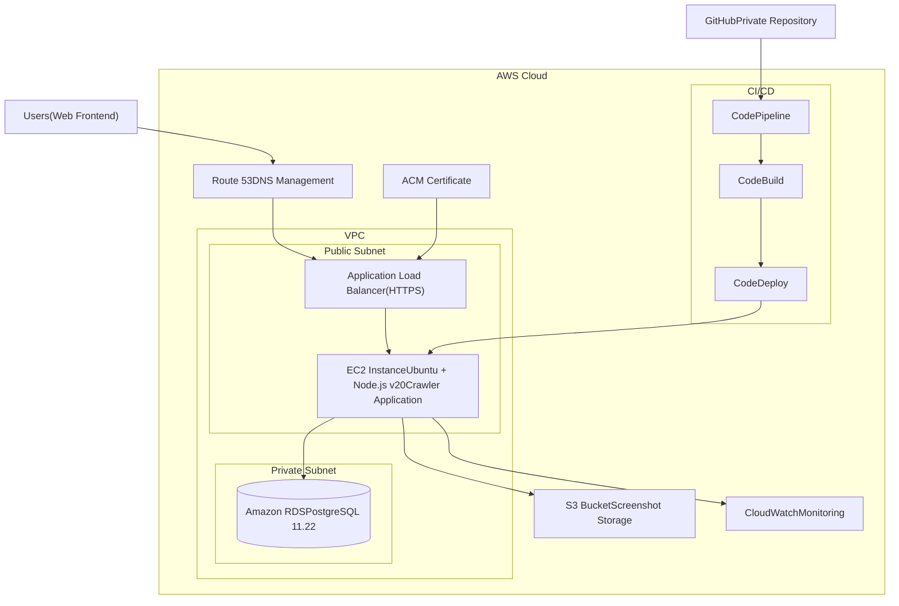

# AWS Implementation Guide


## Overview
This guide details the AWS infrastructure setup for the Ski Card Crawler application.

### Requirements
- AWS Account with administrative access
- AWS CLI installed and configured
- Access to application GitHub repository
- Domain name for frontend access
- Node.js v20 application codebase

### Architecture Components
- EC2 t3.medium (Ubuntu 22.04)
- RDS PostgreSQL 11.22 (db.t3.micro)
- Application Load Balancer
- S3 Bucket for screenshots
- CloudWatch monitoring

## Implementation Steps

### 1. Network Setup

```bash
# Create VPC
aws ec2 create-vpc \
    --cidr-block 10.0.0.0/16 \
    --tag-specifications 'ResourceType=vpc,Tags=[{Key=Name,Value=ski-crawler-vpc}]'

# Create subnets
aws ec2 create-subnet \
    --vpc-id <vpc-id> \
    --cidr-block 10.0.1.0/24 \
    --availability-zone eu-central-1a \
    --tag-specifications 'ResourceType=subnet,Tags=[{Key=Name,Value=ski-crawler-public-1}]'

aws ec2 create-subnet \
    --vpc-id <vpc-id> \
    --cidr-block 10.0.2.0/24 \
    --availability-zone eu-central-1b \
    --tag-specifications 'ResourceType=subnet,Tags=[{Key=Name,Value=ski-crawler-private-1}]'

# Create Internet Gateway
aws ec2 create-internet-gateway \
    --tag-specifications 'ResourceType=internet-gateway,Tags=[{Key=Name,Value=ski-crawler-igw}]'
aws ec2 attach-internet-gateway --vpc-id <vpc-id> --internet-gateway-id <igw-id>
```

### 2. Database Configuration

```bash
# Create DB subnet group
aws rds create-db-subnet-group \
    --db-subnet-group-name ski-crawler-db-subnet \
    --db-subnet-group-description "Subnet group for Ski Crawler DB" \
    --subnet-ids <private-subnet-1-id> <private-subnet-2-id>

# Create RDS instance
aws rds create-db-instance \
    --db-instance-identifier ski-crawler-db \
    --db-instance-class db.t3.micro \
    --engine postgres \
    --engine-version 11.22 \
    --master-username admin \
    --master-user-password <secure-password> \
    --allocated-storage 20 \
    --db-subnet-group-name ski-crawler-db-subnet \
    --backup-retention-period 7 \
    --multi-az false
```

### 3. Application Server Setup

```bash
# Create security group
aws ec2 create-security-group \
    --group-name ski-crawler-sg \
    --description "Security group for Ski Crawler"

# Configure security group rules
aws ec2 authorize-security-group-ingress \
    --group-id <security-group-id> \
    --protocol tcp \
    --port 22 \
    --cidr 0.0.0.0/0

aws ec2 authorize-security-group-ingress \
    --group-id <security-group-id> \
    --protocol tcp \
    --port 80 \
    --cidr 0.0.0.0/0

# Launch EC2 instance
aws ec2 run-instances \
    --image-id ami-0faab6bdbac9486fb \
    --instance-type t3.medium \
    --key-name <your-key-pair> \
    --security-group-ids <security-group-id> \
    --subnet-id <public-subnet-id> \
    --tag-specifications 'ResourceType=instance,Tags=[{Key=Name,Value=ski-crawler}]'
```

### 4. Storage Configuration

```bash
# Create S3 bucket
aws s3 mb s3://ski-crawler-screenshots

# Configure CORS
cat > cors-config.json << EOF
{
    "CORSRules": [
        {
            "AllowedOrigins": ["*"],
            "AllowedHeaders": ["*"],
            "AllowedMethods": ["GET", "PUT", "POST"],
            "MaxAgeSeconds": 3000
        }
    ]
}
EOF

aws s3api put-bucket-cors \
    --bucket ski-crawler-screenshots \
    --cors-configuration file://cors-config.json

# Configure lifecycle rules
aws s3api put-bucket-lifecycle-configuration \
    --bucket ski-crawler-screenshots \
    --lifecycle-configuration file://lifecycle-config.json
```

### 5. Load Balancer Setup

```bash
# Create ALB
aws elbv2 create-load-balancer \
    --name ski-crawler-alb \
    --subnets <public-subnet-1-id> <public-subnet-2-id> \
    --security-groups <security-group-id>

# Create target group
aws elbv2 create-target-group \
    --name ski-crawler-tg \
    --protocol HTTP \
    --port 80 \
    --vpc-id <vpc-id> \
    --health-check-path /health
```

### 6. Application Deployment

```bash
# SSH into EC2 instance
ssh -i <key-pair.pem> ubuntu@<ec2-instance-ip>

# Install Node.js 20
curl -fsSL https://deb.nodesource.com/setup_20.x | sudo -E bash -
sudo apt-get install -y nodejs

# Install PostgreSQL client
sudo apt-get install postgresql-client

# Configure application
git clone <repository-url>
cd <repository-name>

# Setup environment
cat > .env << EOF
DB_HOST=<rds-endpoint>
DB_PORT=5432
DB_NAME=ski_crawler
DB_USER=admin
DB_PASSWORD=<password>
S3_BUCKET=ski-crawler-screenshots
AWS_REGION=eu-central-1
EOF

# Install PM2
npm install -g pm2

# Start application
pm2 start npm --name "ski-crawler" -- start
pm2 startup
pm2 save
```

### 7. SSL/Domain Configuration

```bash
# Install Certbot
sudo apt-get update
sudo apt-get install -y certbot python3-certbot-nginx

# Configure Nginx
sudo apt-get install -y nginx

# Configure SSL
sudo certbot --nginx -d your-domain.com
```

## Monitoring Setup

### CloudWatch Configuration

```bash
# Install CloudWatch agent
sudo apt-get install -y amazon-cloudwatch-agent

# Configure CloudWatch
sudo /opt/aws/amazon-cloudwatch-agent/bin/amazon-cloudwatch-agent-config-wizard

# Create CPU alarm
aws cloudwatch put-metric-alarm \
    --alarm-name cpu-utilization \
    --comparison-operator GreaterThanThreshold \
    --evaluation-periods 2 \
    --metric-name CPUUtilization \
    --namespace AWS/EC2 \
    --period 300 \
    --threshold 80 \
    --statistic Average
```

## Cost Breakdown

| Resource | Monthly Cost |
|----------|--------------|
| EC2 t3.medium | $30 |
| RDS db.t3.micro | $15 |
| S3 storage | $5-10 |
| Load Balancer | $15 |
| **Total** | **$65-70** |

## Cleanup Procedure

```bash
# 1. Delete EC2 instance
aws ec2 terminate-instances --instance-ids <instance-id>

# 2. Delete RDS instance
aws rds delete-db-instance --db-instance-identifier ski-crawler-db

# 3. Delete S3 bucket (optional)
aws s3 rb s3://ski-crawler-screenshots --force

# 4. Delete load balancer
aws elbv2 delete-load-balancer --load-balancer-arn <alb-arn>

# 5. Delete target group
aws elbv2 delete-target-group --target-group-arn <target-group-arn>

# 6. Delete VPC and associated resources
aws ec2 delete-vpc --vpc-id <vpc-id>
```

## Troubleshooting

### Common Issues

1. Database Connectivity
```bash
# Test connection
psql -h <rds-endpoint> -U admin -d ski_crawler
```

2. S3 Access
```bash
# Test S3 permissions
aws s3 ls s3://ski-crawler-screenshots
```

3. Application Logs
```bash
# View logs
pm2 logs ski-crawler
```

### Support Contacts

- AWS Infrastructure: aws-support@company.com
- Application Support: app-support@company.com
- Security Team: security@company.com
