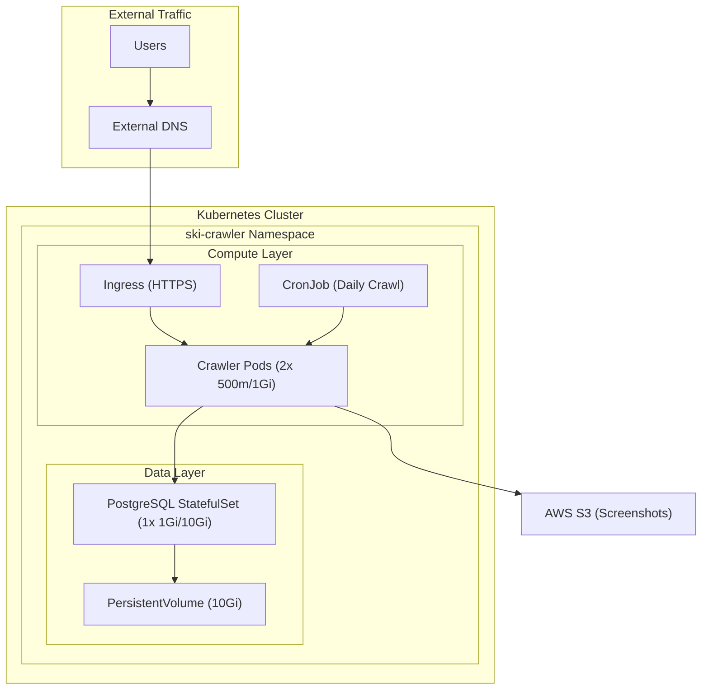

# Kubernetes Implementation Guide


## Overview
This guide details the Kubernetes deployment setup for the Ski Card Crawler application.

### Requirements
- Access to Kubernetes cluster
- kubectl configured
- Helm installed
- Access to application GitHub repository
- AWS S3 access credentials
- Node.js v20 application codebase

### Architecture Components
- 2x Application Pods (500m CPU, 1Gi RAM)
- PostgreSQL StatefulSet (1Gi RAM, 10Gi Storage)
- Nginx Ingress
- S3 Bucket for screenshots
- Prometheus/Grafana monitoring

## Implementation Steps

### 1. Namespace Configuration

```bash
# Create namespace
kubectl create namespace ski-crawler

# Set default namespace
kubectl config set-context --current --namespace=ski-crawler
```

### 2. Database Setup

```yaml
# postgres/secret.yaml
apiVersion: v1
kind: Secret
metadata:
  name: postgres-secret
type: Opaque
data:
  username: <base64-encoded-username>
  password: <base64-encoded-password>

---
# postgres/statefulset.yaml
apiVersion: apps/v1
kind: StatefulSet
metadata:
  name: postgres
spec:
  serviceName: postgres
  replicas: 1
  selector:
    matchLabels:
      app: postgres
  template:
    metadata:
      labels:
        app: postgres
    spec:
      containers:
      - name: postgres
        image: postgres:11.22
        env:
        - name: POSTGRES_DB
          value: ski_crawler
        - name: POSTGRES_USER
          valueFrom:
            secretKeyRef:
              name: postgres-secret
              key: username
        - name: POSTGRES_PASSWORD
          valueFrom:
            secretKeyRef:
              name: postgres-secret
              key: password
        ports:
        - containerPort: 5432
        volumeMounts:
        - name: postgres-storage
          mountPath: /var/lib/postgresql/data
        resources:
          requests:
            memory: "1Gi"
            cpu: "500m"
          limits:
            memory: "2Gi"
            cpu: "1000m"
  volumeClaimTemplates:
  - metadata:
      name: postgres-storage
    spec:
      accessModes: [ "ReadWriteOnce" ]
      resources:
        requests:
          storage: 10Gi

---
# postgres/service.yaml
apiVersion: v1
kind: Service
metadata:
  name: postgres
spec:
  selector:
    app: postgres
  ports:
  - port: 5432
    targetPort: 5432
  clusterIP: None
```

### 3. Application Deployment

```yaml
# app/secret.yaml
apiVersion: v1
kind: Secret
metadata:
  name: aws-secret
type: Opaque
data:
  access-key: <base64-encoded-access-key>
  secret-key: <base64-encoded-secret-key>

---
# app/configmap.yaml
apiVersion: v1
kind: ConfigMap
metadata:
  name: app-config
data:
  DB_HOST: "postgres"
  DB_PORT: "5432"
  DB_NAME: "ski_crawler"
  S3_BUCKET: "ski-crawler-screenshots"
  AWS_REGION: "eu-central-1"

---
# app/deployment.yaml
apiVersion: apps/v1
kind: Deployment
metadata:
  name: ski-crawler
spec:
  replicas: 2
  selector:
    matchLabels:
      app: ski-crawler
  template:
    metadata:
      labels:
        app: ski-crawler
    spec:
      containers:
      - name: ski-crawler
        image: <your-registry>/ski-crawler:latest
        resources:
          requests:
            memory: "1Gi"
            cpu: "500m"
          limits:
            memory: "2Gi"
            cpu: "1000m"
        envFrom:
        - configMapRef:
            name: app-config
        env:
        - name: DB_USER
          valueFrom:
            secretKeyRef:
              name: postgres-secret
              key: username
        - name: DB_PASSWORD
          valueFrom:
            secretKeyRef:
              name: postgres-secret
              key: password
        - name: AWS_ACCESS_KEY_ID
          valueFrom:
            secretKeyRef:
              name: aws-secret
              key: access-key
        - name: AWS_SECRET_ACCESS_KEY
          valueFrom:
            secretKeyRef:
              name: aws-secret
              key: secret-key
        livenessProbe:
          httpGet:
            path: /health
            port: 3000
          initialDelaySeconds: 30
          periodSeconds: 10
        readinessProbe:
          httpGet:
            path: /health
            port: 3000
          initialDelaySeconds: 5
          periodSeconds: 5
```

### 4. Service and Ingress Configuration

```yaml
# app/service.yaml
apiVersion: v1
kind: Service
metadata:
  name: ski-crawler
spec:
  selector:
    app: ski-crawler
  ports:
  - port: 80
    targetPort: 3000
  type: ClusterIP

---
# app/ingress.yaml
apiVersion: networking.k8s.io/v1
kind: Ingress
metadata:
  name: ski-crawler
  annotations:
    kubernetes.io/ingress.class: nginx
    cert-manager.io/cluster-issuer: letsencrypt-prod
spec:
  rules:
  - host: ski-crawler.your-domain.com
    http:
      paths:
      - path: /
        pathType: Prefix
        backend:
          service:
            name: ski-crawler
            port:
              number: 80
  tls:
  - hosts:
    - ski-crawler.your-domain.com
    secretName: ski-crawler-tls
```

### 5. Resource Management

```yaml
# resource-quota.yaml
apiVersion: v1
kind: ResourceQuota
metadata:
  name: ski-crawler-quota
spec:
  hard:
    requests.cpu: "2"
    requests.memory: 4Gi
    limits.cpu: "4"
    limits.memory: 8Gi

---
# hpa.yaml
apiVersion: autoscaling/v2
kind: HorizontalPodAutoscaler
metadata:
  name: ski-crawler
spec:
  scaleTargetRef:
    apiVersion: apps/v1
    kind: Deployment
    name: ski-crawler
  minReplicas: 2
  maxReplicas: 5
  metrics:
  - type: Resource
    resource:
      name: cpu
      target:
        type: Utilization
        averageUtilization: 80
```

## Monitoring Setup

### 1. Prometheus ServiceMonitor

```yaml
# monitoring/servicemonitor.yaml
apiVersion: monitoring.coreos.com/v1
kind: ServiceMonitor
metadata:
  name: ski-crawler
spec:
  selector:
    matchLabels:
      app: ski-crawler
  endpoints:
  - port: metrics
    interval: 30s
```

### 2. Grafana Dashboard

Import the following dashboard configuration:

```json
{
  "dashboard": {
    "title": "Ski Crawler Metrics",
    "panels": [
      {
        "title": "Pod CPU Usage",
        "type": "graph",
        "targets": [
          {
            "expr": "sum(rate(container_cpu_usage_seconds_total{namespace='ski-crawler'}[5m])) by (pod)"
          }
        ]
      },
      {
        "title": "Pod Memory Usage",
        "type": "graph",
        "targets": [
          {
            "expr": "sum(container_memory_usage_bytes{namespace='ski-crawler'}) by (pod)"
          }
        ]
      },
      {
        "title": "HTTP Request Rate",
        "type": "graph",
        "targets": [
          {
            "expr": "sum(rate(http_requests_total{namespace='ski-crawler'}[5m])) by (status_code)"
          }
        ]
      }
    ]
  }
}
```

## Cost Considerations

| Resource | Cost Impact |
|----------|-------------|
| Pod Resources | Uses existing cluster |
| Database Storage | ~$1/10GB/month |
| S3 Storage | $5-10/month |
| Ingress | Uses existing |
| **Total** | **$10-15/month** + cluster costs |

## Cleanup Procedure

```bash
# 1. Delete application resources
kubectl delete -f app/ -n ski-crawler

# 2. Delete database resources
kubectl delete -f postgres/ -n ski-crawler

# 3. Delete monitoring resources
kubectl delete -f monitoring/ -n ski-crawler

# 4. Delete namespace
kubectl delete namespace ski-crawler

# 5. Remove ingress configuration
kubectl delete -f app/ingress.yaml

# 6. Remove TLS secrets
kubectl delete secret ski-crawler-tls -n ski-crawler
```

## Troubleshooting Guide

### Pod Issues
```bash
# Check pod status
kubectl get pods -n ski-crawler

# View pod details
kubectl describe pod <pod-name> -n ski-crawler

# View pod logs
kubectl logs -f <pod-name> -n ski-crawler
```

### Database Issues
```bash
# Check StatefulSet status
kubectl get statefulset -n ski-crawler

# Connect to database
kubectl exec -it postgres-0 -n ski-crawler -- psql -U <username> -d ski_crawler

# View database logs
kubectl logs -f postgres-0 -n ski-crawler
```

### Network Issues
```bash
# Check service status
kubectl get svc -n ski-crawler

# Test network connectivity
kubectl run tmp-shell --rm -i --tty --image nicolaka/netshoot -- /bin/bash

# Check ingress status
kubectl get ingress -n ski-crawler
kubectl describe ingress ski-crawler -n ski-crawler
```


## Additional Resources

- [Kubernetes Documentation](https://kubernetes.io/docs/)
- [Helm Charts Repository](https://artifacthub.io/)
- [Prometheus Operator Guide](https://github.com/prometheus-operator/prometheus-operator)
- [Nginx Ingress Controller](https://kubernetes.github.io/ingress-nginx/)
